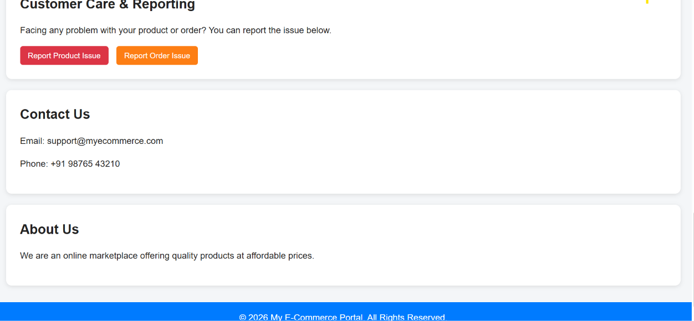
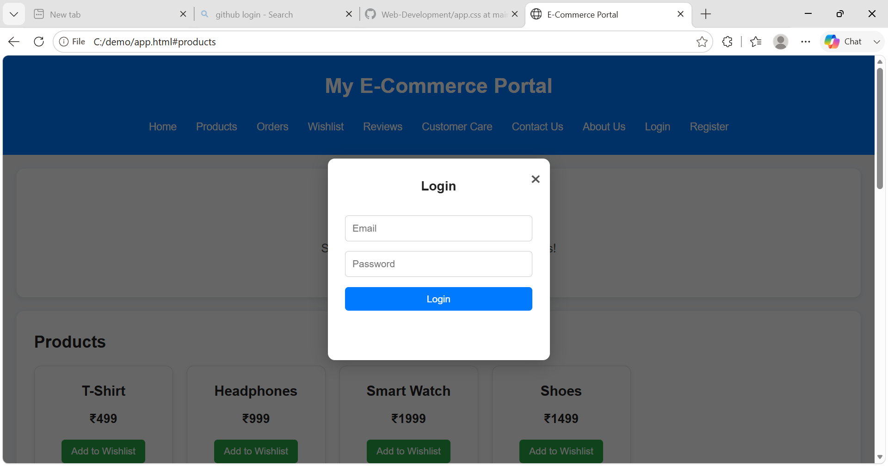
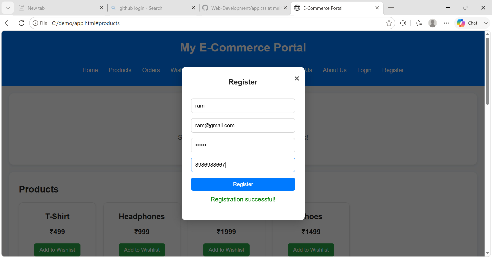
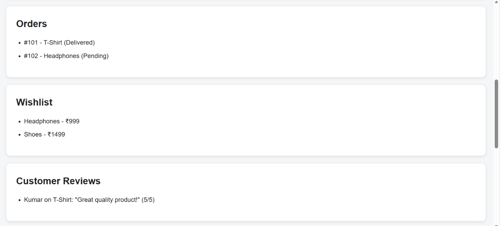

# 🛒 E-Commerce Portal

A simple **E-Commerce Portal** developed using **HTML, CSS, and JavaScript**.
The project demonstrates basic e-commerce functionalities such as user registration, login, product listing, wishlist management, order history, customer reviews, and issue reporting.

## 🚀 Features

* 👤 User Registration
* 🔐 User Login
* 🛍️ Product Listing
* ❤️ Wishlist Management
* 📦 Order History
* ⭐ Customer Reviews
* 🛟 Customer Care & Issue Reporting
* 📞 Contact Us
* ℹ️ About Us
* 💾 User and Wishlist data stored using `localStorage`
* 📱 Responsive Design

## 🛠️ Tech Stack

* **HTML5** – Website structure
* **CSS3** – Styling and responsive design
* **JavaScript** – Functionality and DOM manipulation
* **LocalStorage** – Client-side data storage

## 📂 Project Structure

```text
E-Commerce-Portal/
├── index.html
├── app.css
├── app.js
├── README.md
└── screenshots/
    ├── home-products.jpg
    ├── customer-care-contact-about.png
    ├── login.png
    ├── register.png
    └── orders-wishlist-reviews.png
```










## ⚙️ How to Run

1. Clone or download this repository.
2. Open the project folder.
3. Open `index.html` in any modern web browser.
4. Use the navigation menu to explore the portal.
5. Register a new account and then use the credentials to login.

## 💾 Data Storage

This project uses the browser's **LocalStorage** to store:

* Registered users
* Wishlist items
* Logged-in user information

> ⚠️ **Note:** This is a frontend demonstration project. Passwords are stored in LocalStorage and are **not secure for production use**. A real e-commerce application should use a backend, database, password hashing, and secure authentication.

## 📌 Future Enhancements

* 🛒 Shopping Cart
* 💳 Online Payment Integration
* 🔎 Product Search and Filtering
* 🗄️ Backend & Database Integration
* 🔑 Secure Authentication
* 📊 Admin Dashboard
* 🚚 Real-time Order Tracking

## 👨‍💻 Author

**RK**

B.Tech Information Technology Student

## 📄 License

This project is created for **educational and portfolio purposes**.

